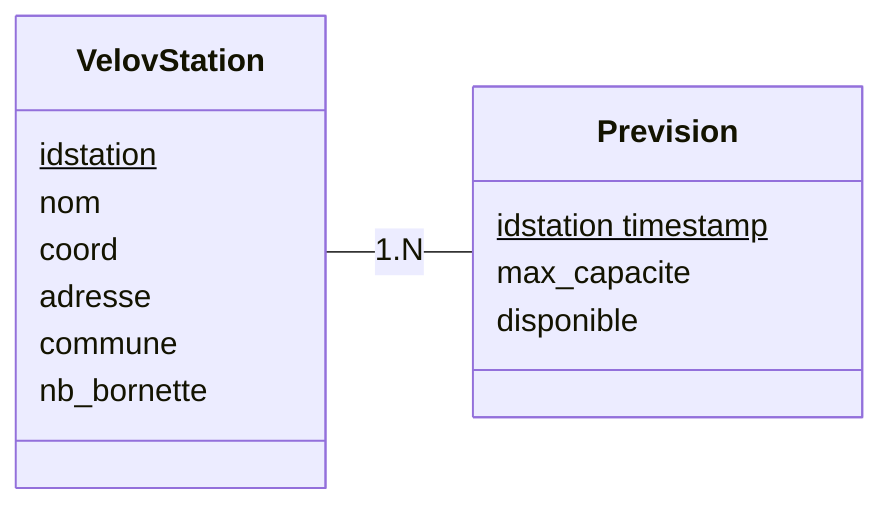

# Project VELOVITE

### Objectif du projet :

- Déterminer la probabilité d'obtenir un velo'v a une station à un moment donné, en fonction des habitudes de flux dans la semaine (ou du mois), la météo, etc.
- Map interactive qui affiche toutes les stations TCL et donne à chacune un pourcentage d'accessibilité.

### Data :

- Météo
- Trajet Velo'v

### Outils :

- Git
- Notion
- Github

Backend :

- PostGreSQL
- Rust
  - diesel (pour faire des requêtes SQL avec Rust)
  - axum (pour faire des api dans le projet)
  - Serde (pour le parsing)
  - reqwest (faire des requêtes sur les api)

Frontend :

- Framework : Svelte

### Développeurs du Projets

- Guillaume CALDERON : En charge du Back-End dans sa généralité.

- Eymeric DECHELETTE : En charge des API et des récoltes des données nécessaires.

- Louka PESIC : En charge du Front-End dans sa généralité.

- Thibaut LARACINE : Chef de projet.
  En charge de la base de données et de ses interactions.

- Léa MICHEL : En charge de la map interactive.

Le scrum master est lui même agile, et sera élu à tour de rôle en fonction des sprints

### lien des API :
  https://data.grandlyon.com/portail/en/jeux-de-donnees/stations-velo-v-metropole-lyon/api
  
  https://data.grandlyon.com/portail/en/jeux-de-donnees/stations-velo-v-metropole-lyon-disponibilites-temps-reel/api
  
  https://open-meteo.com/
  
### Schéma de la base de données

Nécessaire pour stocker les informations que nous créons et utilisons.



### How to use

To run the project in production mode :

```bash
docker compose build
docker compose up -d
```
