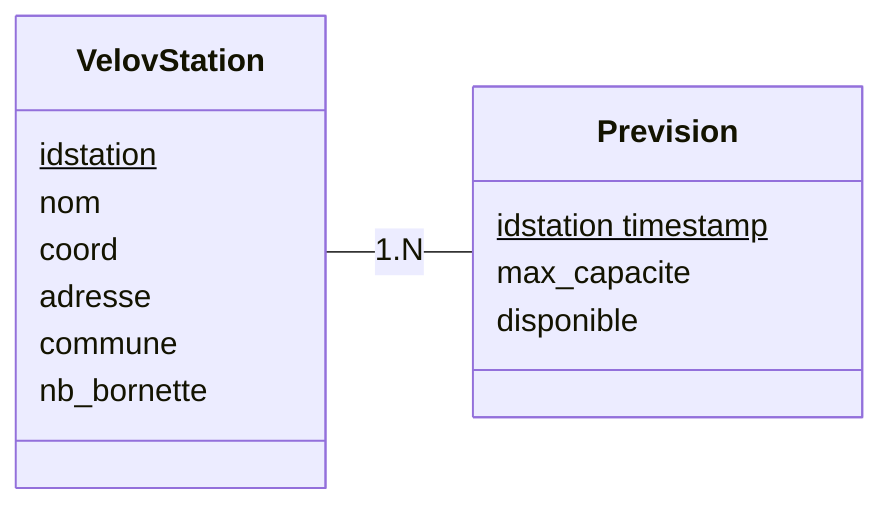

# 🚴‍♂️ Project VELOVITE 🚴‍♀️


### 🎯 Objectif du projet :

- 🔍 Déterminer la probabilité d'obtenir un velo'v à une station à un moment donné, en fonction des habitudes de flux dans la semaine (ou du mois), la météo, etc.
- 🗺️ Map interactive qui affiche toutes les stations TCL et donne à chacune un pourcentage d'accessibilité.

### 📊 Data :

- 🌦️ Météo
- 🚴‍♂️ Trajet Velo'v

### 🛠️ Outils :

- 🐙 Git
- 📒 Notion
- 🐱 Github

Backend :

- 🐘 PostGreSQL
- 🦀 Rust
  - 🛠️ diesel (pour faire des requêtes SQL avec Rust)
  - 🌐 axum (pour faire des api dans le projet)
  - 📦 Serde (pour le parsing)
  - 🌐 reqwest (faire des requêtes sur les api)

Frontend :

- 🖥️ Framework : Svelte

### 👨‍💻 Développeurs du Projets

- Guillaume CALDERON : En charge du Back-End dans sa généralité.
- Eymeric DECHELETTE : En charge des API et des récoltes des données nécessaires.
- Louka PESIC : En charge du Front-End dans sa généralité.
- Thibaut LARACINE : Chef de projet. En charge de la base de données et de ses interactions.
- Léa MICHEL : En charge de la map interactive.

Le scrum master est lui même agile, et sera élu à tour de rôle en fonction des sprints

### 🔗 lien des API :

- [Stations Velo'v](https://data.grandlyon.com/portail/en/jeux-de-donnees/stations-velo-v-metropole-lyon/api)
- [Disponibilités Temps Réel](https://data.grandlyon.com/portail/en/jeux-de-donnees/stations-velo-v-metropole-lyon-disponibilites-temps-reel/api)
- [Open Meteo](https://open-meteo.com/)

### 🗂️ Schéma de la base de données

Nécessaire pour stocker les informations que nous créons et utilisons.



### 🛠️ Comment l'utiliser

#### 📋 Prérequis

- 🐳 Docker
- 🐳 Docker-compose

L'API dispose de ces paramètres :

```bash
Command-line arguments for the application

Usage: velovite-back [OPTIONS]

Options:
  -p, --populate
      --download-velov-data
      --max-velov-features <MAX_VELOV_FEATURES>  [default: 100]
  -s, --velov-start <VELOV_START>                [default: 1]
      --download-weather-data
  -f, --filter-velov-data
  -M, --merge-datas
  -m, --mock
  -b, --benchmark
  -h, --help                                     Print help
  -V, --version                                  Print version
```

Pour modifier les paramètres de lancement de l'API, éditez le fichier .env et ajoutez les paramètres suivants :

```bash
BACKEND_PARAM=" "
```

> ⚠️ Attention à bien mettre un espace si on ne veut aucun paramètre sinon l'API se lancera en mode démonstration

### 🚀 Lancer le projet

Pour lancer le projet en mode développement :

```bash
docker compose build
docker compose up
```

### 🗃️ Generer la base de données

Pour Générer la base de données, il faut lancer le projet avec ces paramètres:

1. 📊 Peupler la base de données : `--populate`
2. 🚴‍♂️ Télécharger les données des stations Velov : `--download-velov-data`

   Vous pouvez spécifier le nombre de stations à télécharger avec l'option `--max-velov-features`

   Vous pouvez également modifier l'index de départ avec l'option `--velov-start`

3. 🔍 Filtrer les données des stations Velov : `--filter-velov-data`
4. 🌦️ Télécharger les données de la météo : `--download-weather-data`
5. 🔄 Fusionner les données : `--merge-datas`

### 🏁 Réaliser les benchmarks

Pour réaliser les benchmarks, il faut lancer le projet avec ce paramètre: `--benchmark`
